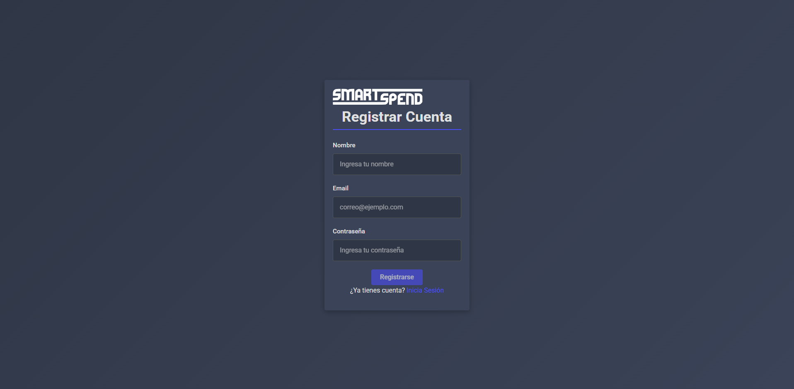
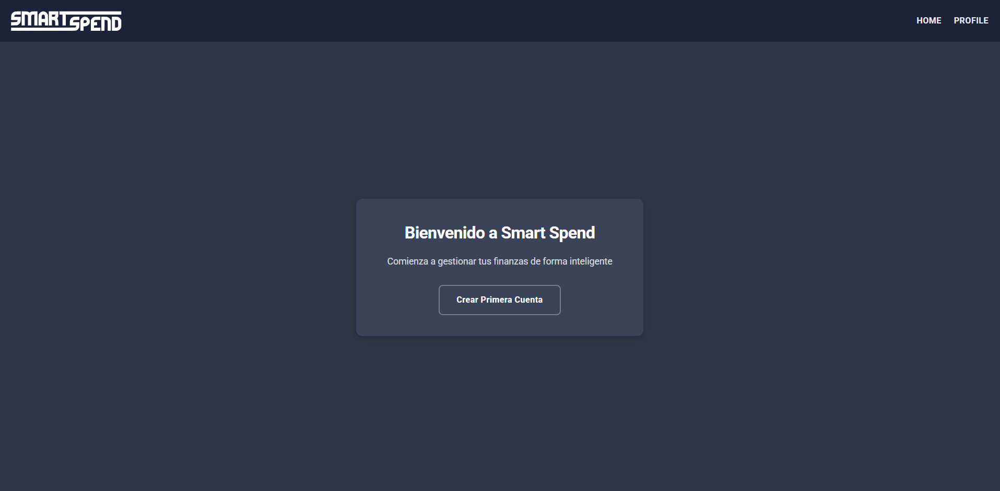
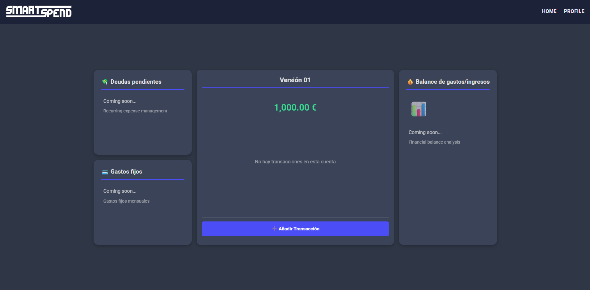
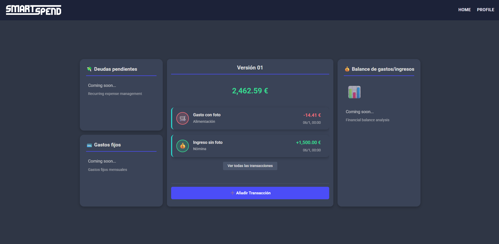

# SMART SPEND 

## Logotipo

---

## ¿Qué es Smart Spend? 
La aplicación Smart Spend surge de la necesidad de llevar un control inteligente y sencillo de las finanzas personales.
Su objetivo principal es ofrecer a los usuarios una interfaz intuitiva que permita registrar gastos o ingresos
de manera rápida y sencilla, para posteriormente analizarlos de manera visual a través de gráficas y diagramas que ayuden a entender los hábitos financieros
Además la aplicación incorpora la funcionalidad de añadir gastos compartidos con otras personas y mantener un control preciso de deudas y balances pendientes.

---

## Documentación 

1. [Objetivos](Readmes/1.Objetivos.md)
2. [Metodología](Readmes/2.Metodologia.md)
3. [Funcionalidades](Readmes/3.Funcionalidades.md)
4. [Análisis](Readmes/4.Analisis.md)
5. [Bocetos](Readmes/5.Bocetos.md)
6. [Autores](Readmes/6.Autores.md)
7. [Guía de desarrollo](Readmes/7.GuiaDeDesarrollo.md)
8. [Ejecución de la app](Readmes/8.Ejecucion.md)

## Versión 01 

## Smart Spend v0.1

La versión **0.1 de Smart Spend** sienta las bases de una gestión financiera personal clara y eficiente.

En esta primera iteración, los usuarios pueden **registrarse** e **iniciar sesión** de forma segura, así como **crear hasta dos cuentas bancarias**, eligiendo en todo momento cuál se mostrará por defecto en la aplicación. Cada cuenta permite el registro detallado de **ingresos y gastos**, organizados por **categorías** para facilitar el control y análisis del dinero.

La aplicación también ofrece la posibilidad de **eliminar transacciones**, **visualizar el perfil de usuario**, **cerrar sesión** y **cambiar de forma sencilla entre las cuentas registradas**.

Esta versión inicial marca el punto de partida para que los usuarios comiencen a tomar el control de sus finanzas diarias de manera intuitiva y ordenada.

---

### Capturas de Pantalla de la Versión 0.1

### Registro

### Inicio de sesión

### Primera entrada a la cuenta

### Página principal con cuenta

### Añadir transacción 

### Página principal con transacciones

### Detalle de transacción 

### Página de perfil

---

### Estado Actual del Proyecto
Smart Spend se encuentra en desarrollo activo. Continuamente estamos trabajando en nuevas funcionalidades y mejoras para ofrecer una experiencia aún más completa y robusta a nuestros usuarios.

---

### Vídeo Demostrativo de la Versión 0.1
https://youtu.be/vEshQWBvltg

---

### Próximas Funcionalidades
## Funcionalidades previstas – Fase intermedia

En la siguiente fase de desarrollo, Smart Spend incorporará nuevas funcionalidades orientadas a mejorar la gestión y el análisis de las finanzas personales, incluyendo la **edición de movimientos**, la **visualización de datos mediante gráficos**, la **consulta del historial completo de ingresos y gastos**, la **búsqueda y filtrado de movimientos**, y la **generación de resúmenes mensuales en formato PDF**, permitiendo al usuario un mayor control y una visión más clara de su información financiera.

---

