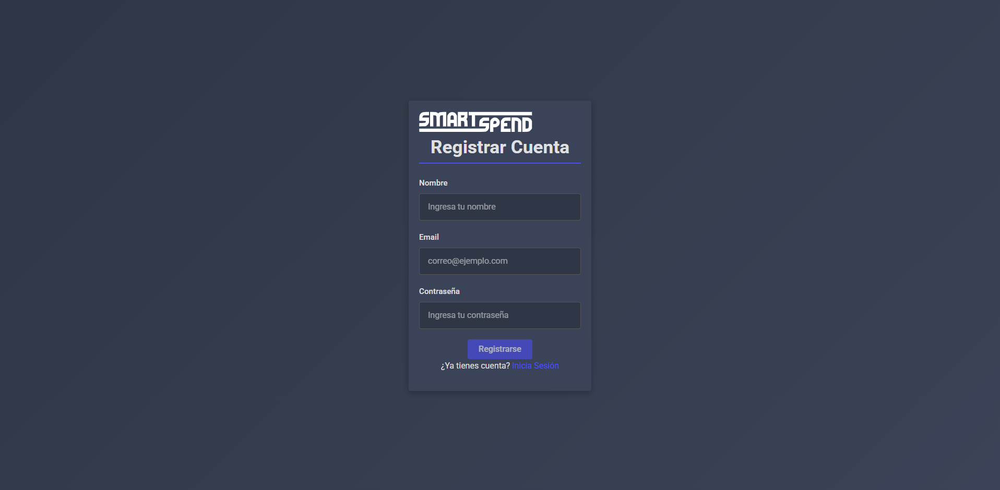
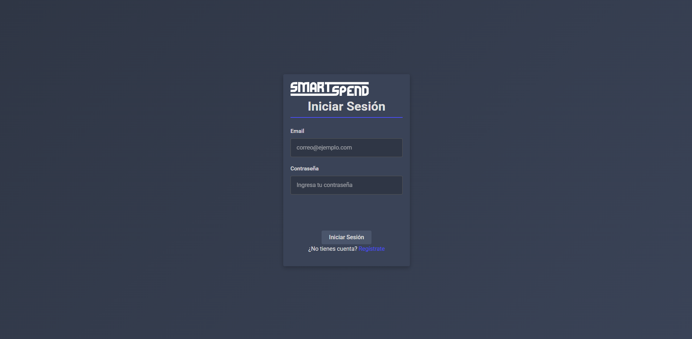
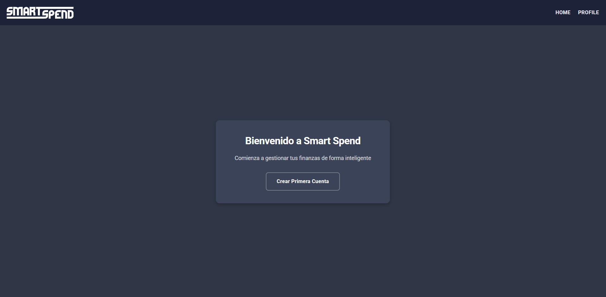
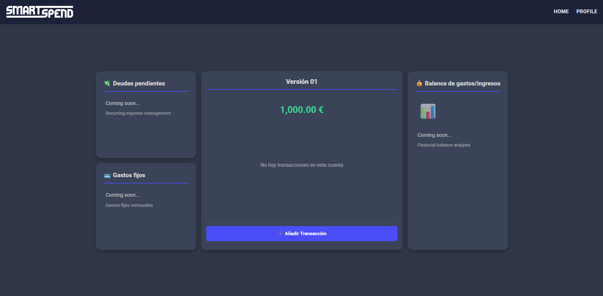
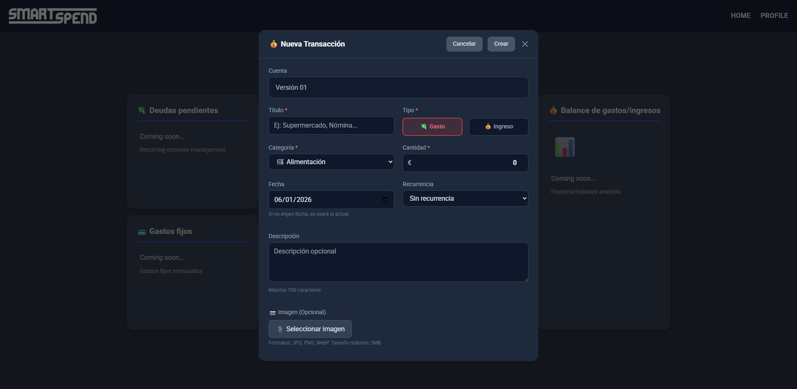
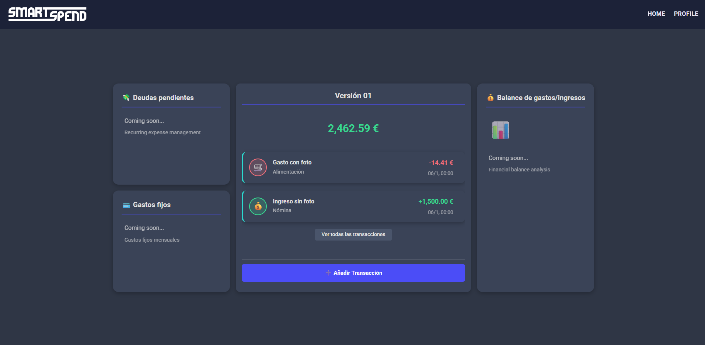
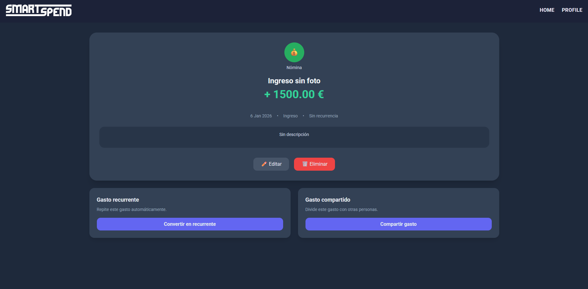
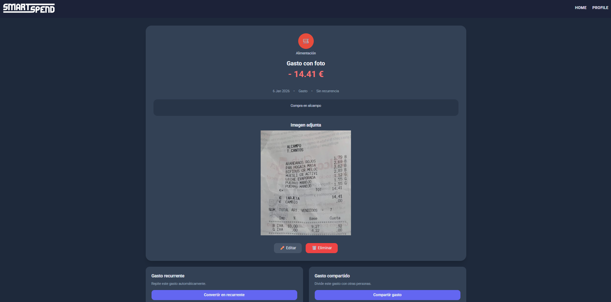
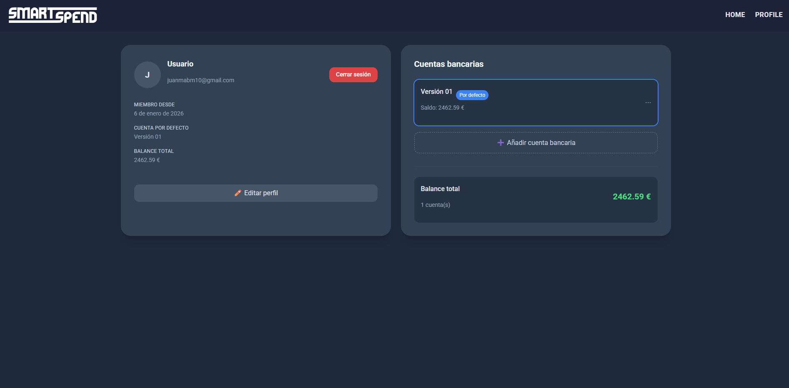

# SMART SPEND 

## Logotipo

---

## ¿Qué es Smart Spend? 
La aplicación Smart Spend surge de la necesidad de llevar un control inteligente y sencillo de las finanzas personales.
Su objetivo principal es ofrecer a los usuarios una interfaz intuitiva que permita registrar gastos o ingresos
de manera rápida y sencilla, para posteriormente analizarlos de manera visual a través de gráficas y diagramas que ayuden a entender los hábitos financieros
Además la aplicación incorpora la funcionalidad de añadir gastos compartidos con otras personas y mantener un control preciso de deudas y balances pendientes.

---

## API REST - Swagger UI

Documentación interactiva de todos los endpoints disponible en:

> **[https://localhost:8443/swagger-ui/index.html](https://localhost:8443/swagger-ui/index.html)**
>
> _(Requiere que el backend esté arrancado. Acepta la excepción de certificado autofirmado en el navegador.)_

---

## Documentación 

1. [Objetivos](Readmes/1.Objetivos.md)
2. [Metodología](Readmes/2.Metodologia.md)
3. [Funcionalidades](Readmes/3.Funcionalidades.md)
4. [Análisis](Readmes/4.Analisis.md)
5. [Bocetos](Readmes/5.Bocetos.md)
6. [Autores](Readmes/6.Autores.md)
7. [Guía de desarrollo](Readmes/7.GuiaDeDesarrollo.md)
8. [Ejecución de la app](Readmes/8.Ejecucion.md)

## Versión 01 

## Smart Spend v0.1

La versión **0.1 de Smart Spend** sienta las bases de una gestión financiera personal clara y eficiente.

En esta primera iteración, los usuarios pueden **registrarse** e **iniciar sesión** de forma segura, así como **crear hasta dos cuentas bancarias**, eligiendo en todo momento cuál se mostrará por defecto en la aplicación. Cada cuenta permite el registro detallado de **ingresos y gastos**, organizados por **categorías** para facilitar el control y análisis del dinero.

La aplicación también ofrece la posibilidad de **eliminar transacciones**, **visualizar el perfil de usuario**, **cerrar sesión** y **cambiar de forma sencilla entre las cuentas registradas**.

Esta versión inicial marca el punto de partida para que los usuarios comiencen a tomar el control de sus finanzas diarias de manera intuitiva y ordenada.

---

### Capturas de Pantalla de la Versión 0.1

### Registro

### Inicio de sesión

### Primera entrada a la cuenta

### Página principal con cuenta

### Añadir transacción 

### Página principal con transacciones

### Detalle de transacción 

### Página de perfil

---

### Estado Actual del Proyecto
Smart Spend se encuentra en desarrollo activo. Continuamente estamos trabajando en nuevas funcionalidades y mejoras para ofrecer una experiencia aún más completa y robusta a nuestros usuarios.

---

### Vídeo Demostrativo de la Versión 0.1
https://youtu.be/vEshQWBvltg

---

### 🌐 Acceso a la Aplicación en Producción

Smart Spend está desplegado en **Render** y disponible en:

🔗 **URL de producción:** https://smartspend-dev.onrender.com

La base de datos de producción está en **Aiven** y se mantiene **desacoplada** de la aplicación, lo que permite separar responsabilidades entre plataforma de ejecución y persistencia.

Para más detalles técnicos sobre despliegue y arquitectura de entornos, consulta la [Guía de Desarrollo](Readmes/7.GuiaDeDesarrollo.md#despliegue-en-produccion-render).

---

### Novedades Funcionales Recientes

En las iteraciones recientes se han incorporado mejoras importantes en experiencia de usuario y navegación:

- Historial completo de movimientos con **paginación real** y rango de resultados visible.
- Filtros de transacciones dentro de un **panel colapsable** en la vista de historial.
- **Rediseño de la vista de detalle de transacción** con layout por tarjetas, resumen financiero y mejor presentación de adjuntos/progreso de deuda.
- **Unificación visual global** con paleta cian/teal para mantener consistencia entre pantallas.

---
