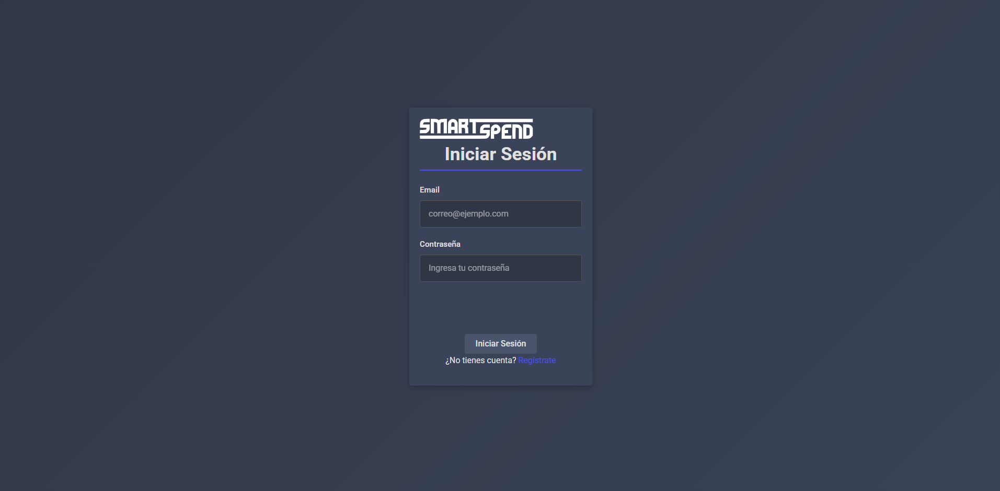
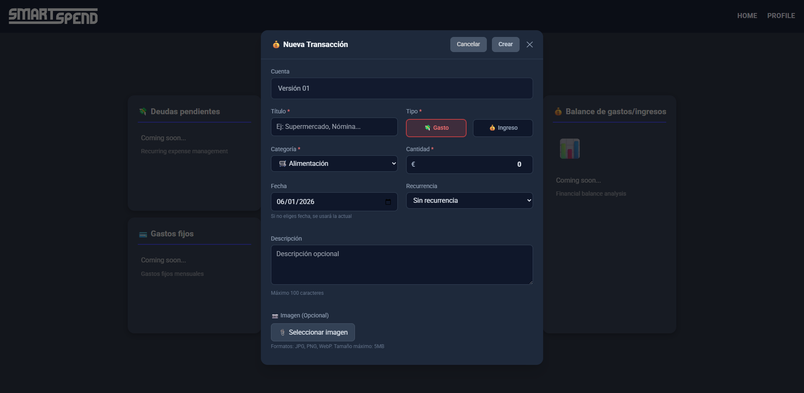
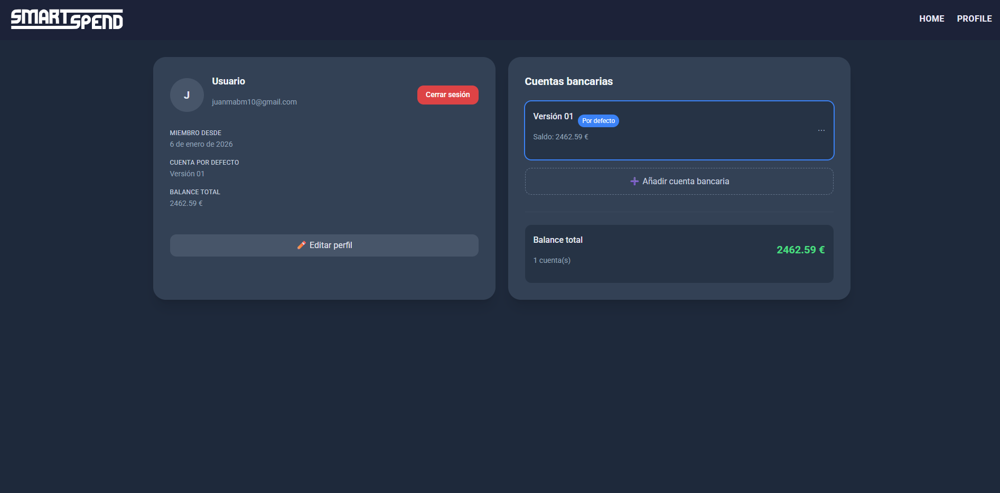
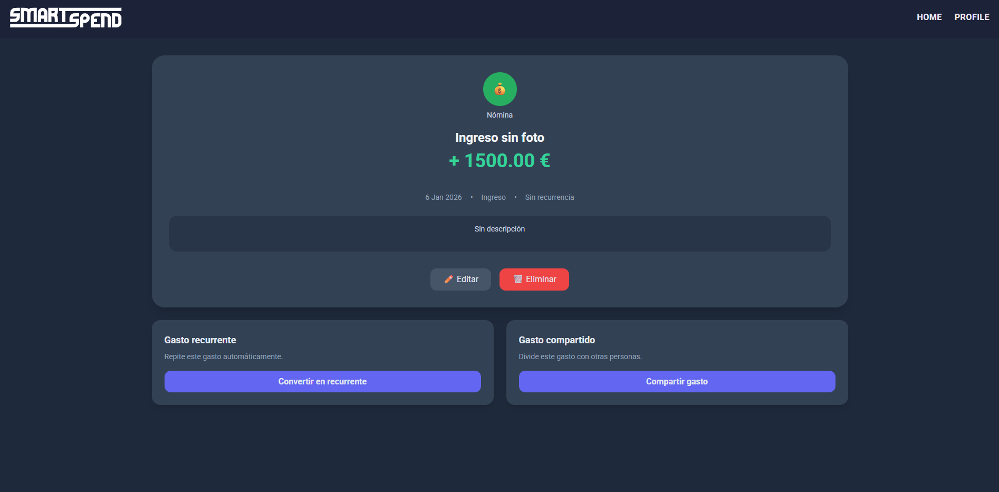

## 📝 FUNCIONALIDADES

### BÁSICAS
- **Inicio sesión/registro (google)**  

      

    Permite crear una cuenta personal y acceder a ella de manera segura, si el usuario aun no dispone de cuenta podrá pinchar en el enlace que le llevará a la pantalla para registrar su cuenta.
    Pendiente (google)
- **Añadir transacción**
    
    

    Permite al usuario registrar un gasto o un ingreso mediante un formulario sencillo, introduciendo la información necesaria para su correcta gestión.  
  Los datos que se pueden introducir son:
  - **Obligatorios**
    - Importe  
    - Título  
    - Categoría (seleccionada de entre las disponibles en la aplicación)
    - Tipo (gasto/ingreso)
  - **Opcionales**
    - Descripción  
    - Imágen asociada al gasto
    - Recurrencia
    - Cambio de fecha (si no se establece la del momento por defecto)

- **Añadir nueva cuenta bancaria**

    
    
    El usuario puede vincular hasta 2 cuentas en su perfil personal pulsando en el botón de añadir cuenta, apareciendo este solo en el caso de no tener ya dos. 
---
### INTERMEDIAS
- **Editar movimientos**

    Una vez añadido un ingreso o un gasto el usuario tendrá la opción de editar cualquiera de los campos guardando los cambios antes de finalizar
- **Eliminar movimientos**

    

    Una vez añadido un ingreso o un gasto el usuario tendrá la opción de eliminarlo pulsando en el boton rojo de eliminar y confirmando el pop up a modo de aviso que saltará al pulsarlo. 
- **Visualizar gráficos**

    La aplicación ofrecerá un apartado de gráficos que permitirá al usuario interpretar sus movimientos de forma clara y visual mediante varias opciones de gráficos. 
    Los tipos de gráficos son los siguientes:
    - Gráfico de barras (ingresos/gastos): muestra una barra de ingresos y otra de gastos 
    - Gráfico de sectores (categorias): muestra un diagrama de sectores dividiendo todas las categorias en las que gastaste mostrandote el porcentaje total del mes
    - Gráfico lineal: muestra el aumento y descenso de tus ingresos y gastos a lo largo del tiempo establecido.
    - Vista de calendario: muestra un calendario marcándote los gastos e ingresos en cada dia.
    
    NOTA: explicar bien lo de los tiempos
- **Consultar historial gastos/ingresos**

    Permite al usuario consultar todo su historial de movimientos (botón de mostrar más)
- **Buscar movimientos**

    Permite al usuario hacer una búsqueda o filtrado de sus movimientos a través de campos.
- **Generar pdf mensual**

    El usuario podrá generar un archivo PDF al finalizar cada mes como resumen de sus movimientos, incluyendo métricas y estadísticas además de gráficos
---
### AVANZADAS
- **Añadir gasto compartido**

    El usuario podrá añadir un gasto compartido con otras personas pudiendo dividir el importe total entre el número de personas que decida añadir de manera equitativa (automáticamente) o manual, dando a cada persona un gasto específico.

    El usaurio podrá dentro de este gasto marcar qué persona pagó ya su parte y quién no, manteniendo así, un control y seguimiento de deudas.
- **Añadir gasto/ingreso fijos**
    
    El usuario podrá automatizar la funcionalidad de añadir un gasto o un ingreso indicando la frecuencia en el tiempo de este, en las opciones avanzadas de añadir gasto/ingreso.
- **Control de deudas y balances pendientes**

    El sistema será capaz de controlar y balancear el importe total de la cuenta de manera automática al añadir, editar, eliminar gastos y/o ingresos, además de balancear las deudas una vez se vayan saldando.
- **Algoritmo de previsión de gastos futuros**

    La aplicación realizará un análisis del historial de movimientos del usuario y aplicará el algoritmo de previsión de posibles gastos futuros

## 📊 Estado de las funcionalidades

| Dificultad | Funcionalidad                          | Estado        |
|------------|----------------------------------------|---------------|
| Básica     | Inicio de sesión / Registro             | ✅ Implementada |
| Básica     | Inicio de sesión con Google             | ⏳ Pendiente   |
| Básica     | Añadir transacción                      | ✅ Implementada |
| Básica     | Añadir nueva cuenta bancaria            | ✅ Implementada |
| Intermedia | Editar movimientos                     | ⏳ Pendiente   |
| Intermedia | Eliminar movimientos                   | ✅ Implementada |
| Intermedia | Visualizar gráficos                    | ⏳ Pendiente   |
| Intermedia | Consultar historial de gastos/ingresos | ⏳ Pendiente   |
| Intermedia | Buscar movimientos                     | ⏳ Pendiente   |
| Intermedia | Generar PDF mensual                    | ⏳ Pendiente   |
| Avanzada   | Añadir gasto compartido                | ⏳ Pendiente   |
| Avanzada   | Añadir gasto/ingreso fijo              | ⏳ Pendiente   |
| Avanzada   | Control de deudas y balances pendientes| ⏳ Pendiente   |
| Avanzada   | Algoritmo de previsión de gastos futuros | ⏳ Pendiente   |
