## 📝 FUNCIONALIDADES

### BÁSICAS
- **Inicio sesión/registro (google)**  

    

    El sistema garantiza un entorno seguro y versátil de acceso a la plataforma. Para ello, ofrece dos mecanismos diferenciados:
    *   **Autenticación tradicional:** A través de credenciales estándar (correo electrónico y contraseña). Este flujo requiere el registro previo del usuario en la base de datos para su posterior validación de identidad.
    *   **Integración con Google OAuth2:** Permite un registro y acceso más simple y directo, lo cual mejora la experiencia del usuario.

    Tras una autenticación exitosa, el servidor proporciona un token de acceso único (basado en el estándar JWT) con un tiempo de caducidad de 15 minutos. Esta medida de seguridad, asegura que las sesiones inactivas sean invalidadas automáticamente para proteger la integridad de los datos financieros frente a accesos no autorizados, lo que obliga al usuario a identificarse nuevamente.

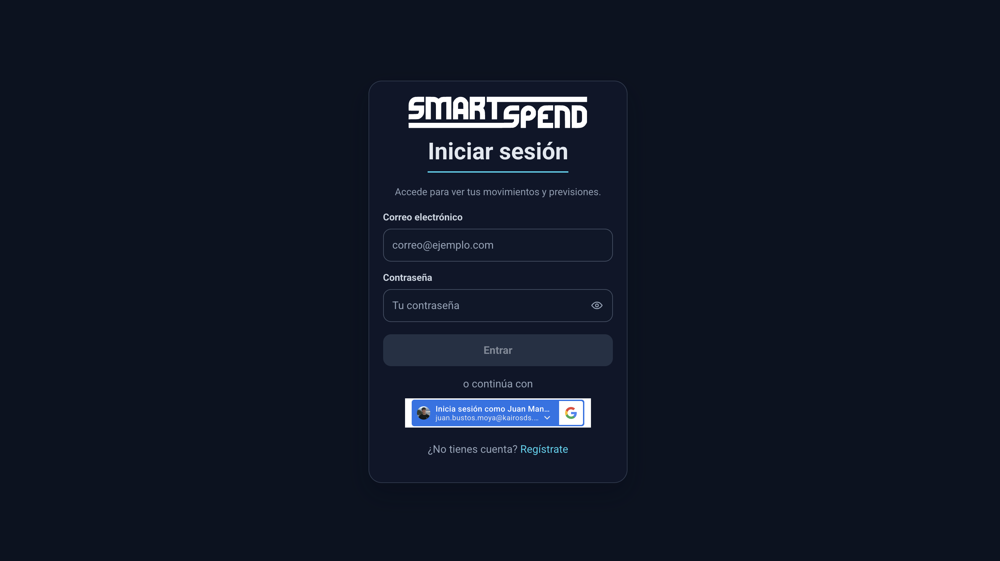  

- **Añadir transacción**
    
    

    Este módulo permite al usuario registrar un gasto o un ingreso mediante un formulario sencillo, introduciendo la información necesaria para su correcta gestión. Los datos se clasifican según su obligatoriedad:
    *   **Datos obligatorios:** Importe, título, categoría (seleccionada de entre las disponibles en la aplicación) y tipo (gasto o ingreso).
    *   **Datos opcionales:** Descripción, imagen asociada al gasto (tique o factura), recurrencia (diaria, semanal, mensual, anual) y fecha (el sistema asigna por defecto el momento actual).
    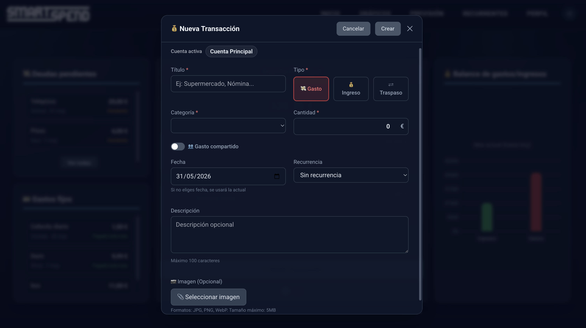

- **Añadir nueva cuenta bancaria**

    El usuario puede vincular hasta dos cuentas en su perfil personal pulsando en el botón de añadir cuenta, que aparece solamente en el caso de no tener ya dos existentes.

    
    
    
---
### INTERMEDIAS
- **Editar y eliminar movimientos**

    Para asegurar que la información sea siempre fiel a la realidad, se permiten las operaciones de modificación y borrado:
    *   **Edición:** Al activar esta opción, se despliega un formulario pre-rellenado con los datos actuales del movimiento, permitiendo su actualización inmediata.
    *   **Eliminación:** Como medida de seguridad e integridad de datos, el sistema requiere una confirmación explícita mediante una ventana emergente (*pop-up*) antes de proceder al borrado definitivo.

    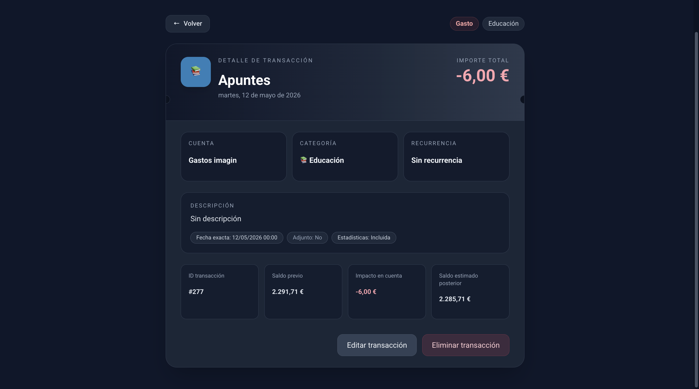
    

 
- **Visualizar gráficos**

    El sistema ofrece un módulo estadístico avanzado para la interpretación visual de las finanzas. El usuario puede establecer rangos temporales específicos para comparar periodos (meses o años) a través de tres tipos de representaciones:
    *   **Gráfico de barras:** Comparativa directa entre el volumen total de ingresos y gastos.
    *   **Gráfico de sectores:** Distribución porcentual del gasto según las categorías utilizadas en el mes.
    *   **Gráfico lineal:** Evolución histórica de la salud financiera. Muestra las tendencias a lo largo del tiempo a través de tres líneas que hacen referencia a los gastos, los ingresos y al balance entre los dos parámetros anteriores.

    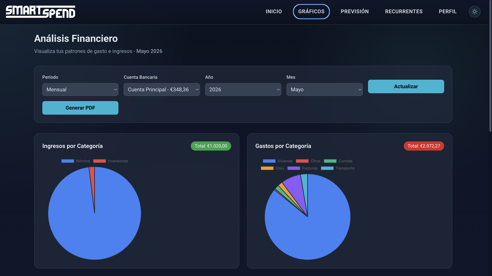
    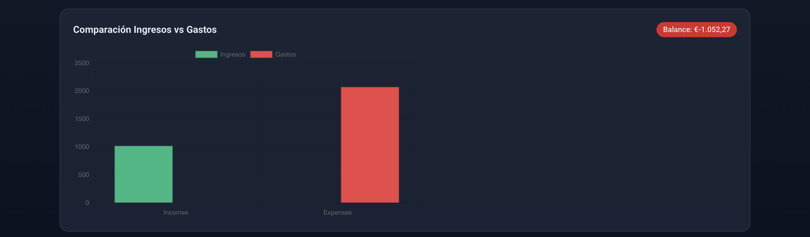
    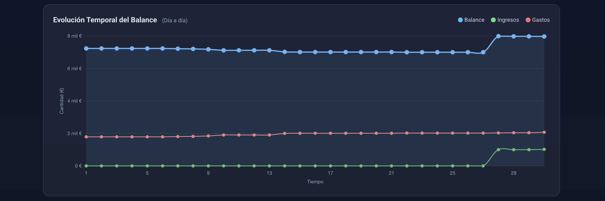

- **Consultar historial gastos/ingresos**

    Permite al usuario consultar todo su historial de movimientos con **paginación**, mostrando rangos de resultados y navegación por páginas.
        
- **Buscar movimientos**

   Para mejorar la auditoría y localización de los registros entre un volumen de datos elevados, SmartSpend facilita al usuario una sección completa donde poder hacer uso del motor de búsqueda avanzado de manera flexible. Esto permite al usuario encontrar información sin recordar datos exactos que componen la transacción. Los filtros mencionados ofrecen:
    *   **Búsqueda por texto flexible:** El sistema permite la localización de movimientos mediante el título o la descripción. Esta búsqueda se basa en coincidencias parciales, lo que significa que el usuario puede encontrar un registro introduciendo solo una palabra clave o una parte de la frase, sin que esta deba ser idéntica al texto guardado.
    *   **Filtros de rango:** A diferencia de las búsquedas simples, el motor permite establecer intervalos numéricos y temporales:
        *   Rango de cuantía: Posibilidad de filtrar movimientos estableciendo un importe mínimo y máximo.
        *   Rango de fechas: Selección de un periodo concreto mediante fechas de inicio y fin para acotar la búsqueda cronológicamente.
    *   **Lógica de filtrado dependiente (Tipo/Categoría):** El sistema vincula las categorías al tipo de transacción (ingreso o gasto). Al seleccionar el tipo, el selector de categorías se actualiza dinámicamente para mostrar únicamente las opciones coherentes, evitando resultados inconsistentes.

        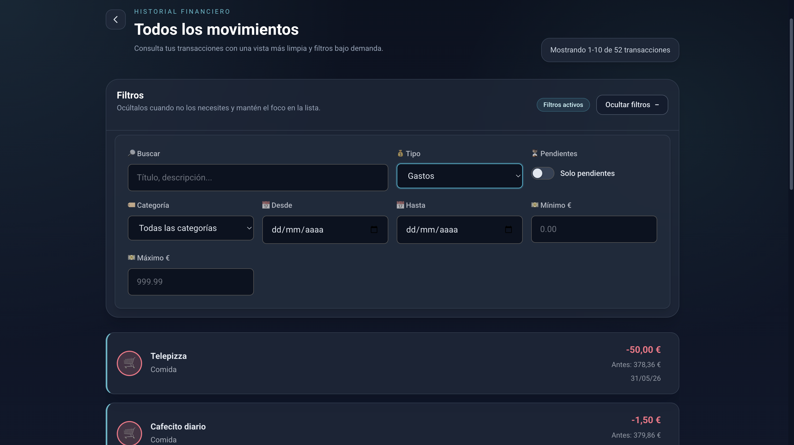
- **Generar pdf mensual**

    s, estadísticas y gráficos del periodo seleccionado para su uso externo.

- **Pantalla principal con gráficos
    Es el núcleo visual de la aplicación. Su objetivo es ayudar al usuario a que, en un solo vistazo, sea capaz de tener un resumen global del estado de sus finanzas. En caso de querer indagar, el propio dashboard proporciona enlaces a todas las demás páginas de la aplicación. Este contiene:
    *   **Visualización de cuenta y flujo de caja:** El panel central muestra el balance actual de la cuenta y el histórico de movimientos más recientes. Desde aquí, el usuario podrá visualizar sus dos últimos gastos, acceder al histórico completo de transacciones o añadir una nueva.
    *   **Gestión de deudas pendientes:** Ubicado en la sección superior izquierda, muestra el listado de deudas vigentes. Si el usuario pulsa sobre una deuda, el sistema permite acceder al gasto padre y al detalle de la transacción original.
    *   **Vista de gastos fijos:** Este recuadro, situado en la zona inferior izquierda, proporciona información de los gastos fijos (pagados y pendientes) correspondientes al mes actual.
    *   **Gráfico ingresos/gastos:** Situado en la parte derecha, ofrece una vista inmediata del acumulado de ingresos frente a gastos hasta la fecha del mes en curso.
    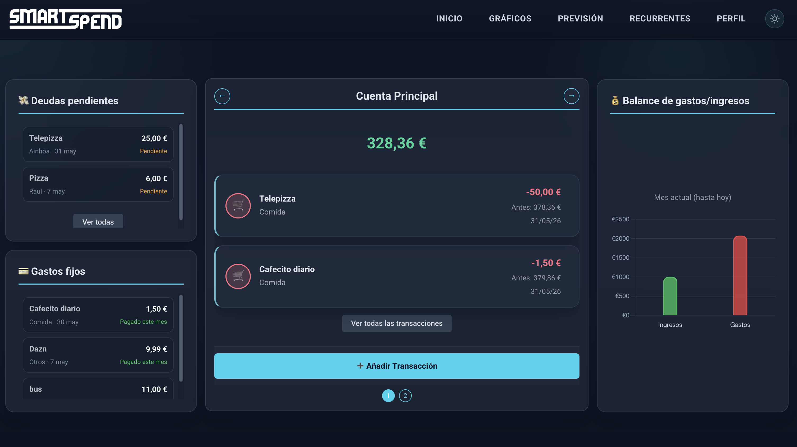

---
### AVANZADAS
Se agrupan en esta sección aquellas características que aportan el mayor valor diferencial y que han requerido un desarrollo lógico más complejo.

- **Añadir gasto compartido**
    Representa una de las innovaciones centrales del proyecto y lo que supone ser una novedad en aplicaciones de este ámbito. Permite registrar transacciones cuyo coste se distribuye entre varios participantes, en modalidades diferentes:
    *   **División equitativa:** El sistema calcula de manera proporcionada entre los diferentes participantes del grupo basándose en el gasto total.
    *   **Manual:** El usuario será responsable de añadir el gasto específico que le corresponde a cada participante incluido a sí mismo.
    *   **Híbrida:** El usuario podrá insertar gastos manuales a uno o varios participantes y el monto restante repartirlo de forma equitativa entre los faltantes.
    Tras completar la fase de ingreso de este gasto compartido esta funcionalidad continúa ofreciendo seguimiento mediante:
    *   **Trazabilidad y estados del reparto:** La interfaz proporciona un resumen detallado que incluye:
        *   Resumen financiero: Desglose entre total, parte real de impacto en cuenta y cuantía adeudada.
        *   Estado del reparto: Visualización dinámica mediante barras de progreso y contadores de participantes que han pagado frente a los pendientes.
        *   Interacción y Persistencia: Cada participante vinculado al gasto dispone de un control de selección (*checkbox*) que representa su estado de pago. Al accionar este control, la aplicación no solo actualiza la interfaz de forma reactiva, sino que realiza una petición al backend para modificar el estado de la deuda en la base de datos, garantizando que la información persista entre sesiones.
    *   **Generación de compensación:** Para dejar constancia y mantener la consistencia de los datos y del saldo, el sistema genera movimientos de compensación en este caso de ingreso, pero con la condición de no influir en los gráficos ni estadísticas permitiendo así el correcto cálculo de estas no inflándolas ni alterándolas de forma irreal.
    *   **Integración con el Cuadro de Mando:** Existe una sincronización bidireccional entre este módulo y el dashboard. Cualquier deuda marcada como "pendiente" en esta vista se refleja automáticamente en el widget de "Deudas pendientes" de la pantalla principal, permitiendo al usuario realizar un seguimiento proactivo de sus cobros sin tener que navegar por el histórico.

    Esta arquitectura permite que el usuario actúe como "pagador principal" sin perder el control sobre su presupuesto personal real sin perder de vista las deudas generadas.
    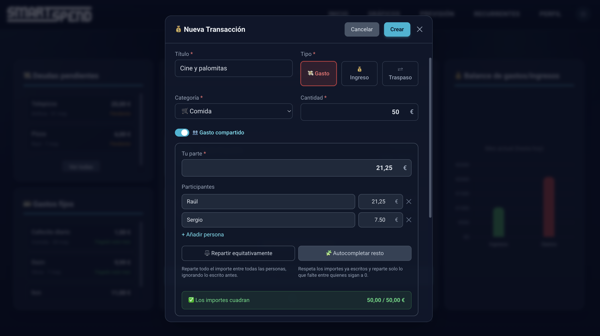
    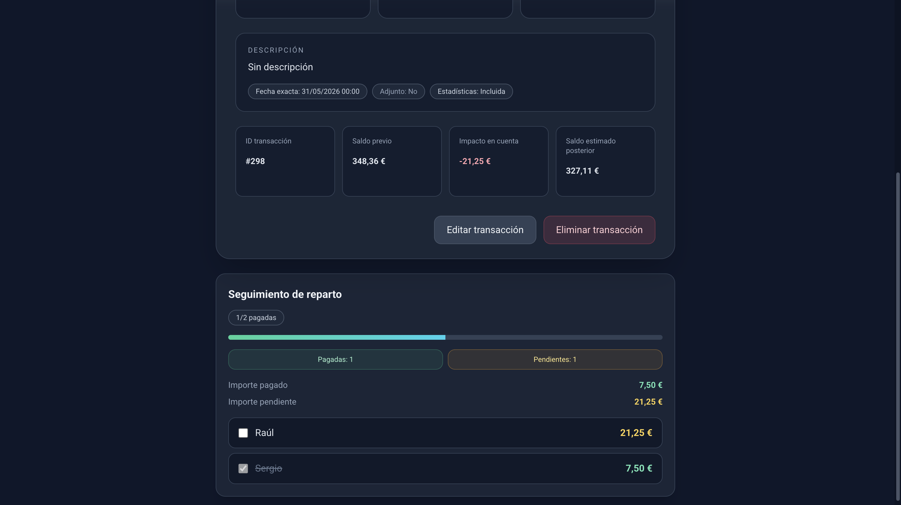

- **Añadir gasto/ingreso fijos**
   Con el objetivo de ayudar al usuario, SmartSpend implementa un sistema de creación automática de movimientos para minimizar la carga manual y posibles olvidos del usuario. Para ello basta con que el usuario indique la fecha exacta y una recurrencia (diaria, semanal, mensual o anual).
    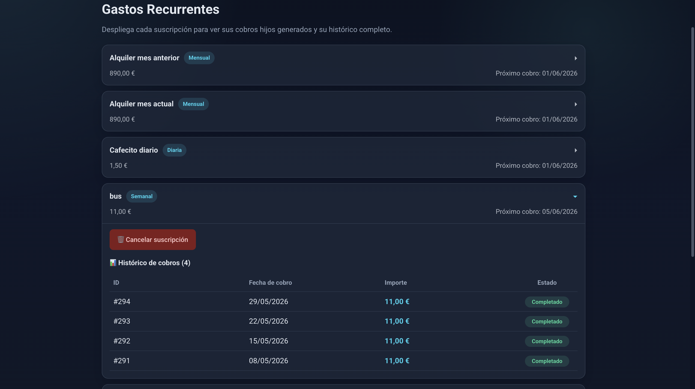

- **Lógica de consistencia y balanceo automático de saldos**

    Más allá del registro individual de movimientos, el sistema implementa una lógica de integridad financiera que asegura que el patrimonio neto mostrado al usuario sea siempre exacto y coherente. Esta funcionalidad de "balanceo automático" actúa como un proceso transversal a toda la aplicación:
    *   **Recalculo dinámico por operaciones CRUD:** Ante cualquier inserción, modificación o borrado de una transacción, el sistema dispara un algoritmo de balanceo, manteniendo el saldo consistente.
    *   **Sincronización de activos compartidos:** El sistema diferencia técnicamente entre el saldo líquido en cuenta y el saldo "en espera" (deudas). Cuando una deuda se marca como liquidada, el algoritmo de balanceo realiza una conciliación: reduce el activo de "deuda" y aumenta el saldo real de la cuenta de forma automática, sin que el usuario tenga que realizar un ingreso manual extra.

    Esta automatización elimina el error humano y garantiza que SmartSpend funcione como un libro de contabilidad profesional, donde cada céntimo está justificado y vinculado a una acción del sistema.

- **Algoritmo de previsión de gastos futuros**

    Este motor de previsión representa una de las funcionalidades más potentes de la aplicación, ofreciendo al usuario la posibilidad de observar una posible estimación al cierre del mes actual, con el objetivo de permitir al usuario anticipar su situación económica al futuro cercano y poder así adaptar sus gastos a dicha previsión. Para ello la interfaz se divide actualmente en tres bloques entre los cuáles se encuentran realizados tres tipos diferentes de análisis:
    *   **Gestión de gastos fijos:** Este panel identifica y muestra el total de los pagos recurrentes programados para final del mes. Este bloque permite visualizar ese gasto que ya está "comprometido" independientemente de lo que ocurra en el resto del mes, antes de que incluso se realice el desembolso.
    *   **Balance Proyectado (Análisis Comparativo):** Mediante un gráfico de barras tricolor, el sistema realiza un estudio comparativo en tres tiempos:
        *   Mes anterior: Sirve como línea base para evaluar el rendimiento actual frente al mes pasado.
        *   Mes actual (Real): Muestra el acumulado de ingresos y gastos realizados hasta el momento actual.
        *   Previsión: Representa el posible cierre mensual calculado por el algoritmo. La barra de previsión marca el objetivo estimado, permitiendo detectar de forma visual desviaciones presupuestarias antes de que finalice el periodo.
    *   **Análisis de tendencias por categoría:** En esta vista, podremos observar un estudio específico por categoría, mostrando el mes anterior, el acumulado actual, la previsión de cierre y, finalmente, un indicador de tendencia porcentual respecto al mes anterior. Esto permite identificar las categorías que tienen mayor protagonismo durante el mes, permitiendo su control de manera más centralizada.
    **Lógica del Algoritmo de Previsión**

    Para este cálculo de las proyecciones, el sistema no realiza una simple fórmula aritmética, sino que aplica un modelo de regresión lineal, basado en el ritmo de gasto histórico del usuario.

    La expresión matemática que rige la previsión es la siguiente:
    `Pfin = Gactual + (G3m / 30 × Drestantes)`

    Donde cada variable se define como:
    *   `Pfin`: Previsión del gasto total estimado al cierre del mes en curso.
    *   `Gactual`: Gasto total acumulado desde el primer día del mes hasta la fecha actual.
    *   `G3m`: Promedio de gasto mensual registrado durante el último trimestre. Al dividirse por la constante 30 (media de días por mes), se obtiene el gasto medio diario estimado.
    *   `Drestantes`: Número de días naturales que restan para la finalización del mes actual.

    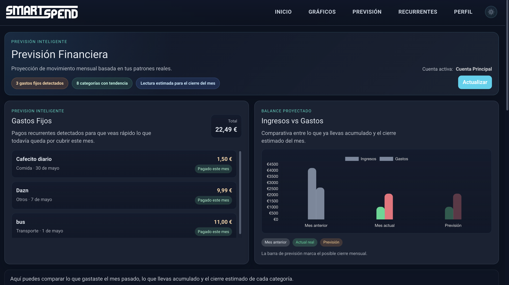
    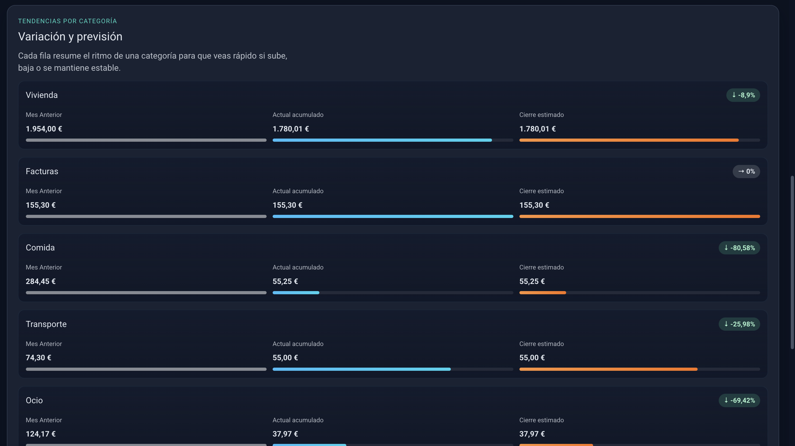

## 📊 Estado de las funcionalidades

| Dificultad | Funcionalidad                          | Estado        |
|------------|----------------------------------------|---------------|
| Básica     | Inicio de sesión / Registro             | ✅ Implementada |
| Básica     | Inicio de sesión con Google             | ✅ Implementada |
| Básica     | Añadir transacción                      | ✅ Implementada |
| Básica     | Añadir nueva cuenta bancaria            | ✅ Implementada |
| Intermedia | Editar movimientos                     | ✅ Implementada  |
| Intermedia | Eliminar movimientos                   | ✅ Implementada |
| Intermedia | Visualizar gráficos                    | ✅ Implementada   |
| Intermedia | Consultar historial de gastos/ingresos | ✅ Implementada   |
| Intermedia | Buscar movimientos                     | ✅ Implementada   |
| Intermedia | Generar PDF mensual                    | ✅ Implementada   |
| Intermedia | Historial paginado                     | ✅ Implementada   |
| Intermedia | Panel de filtros colapsable            | ✅ Implementada   |
| Intermedia | Detalle de transacción rediseñado      | ✅ Implementada   |
| Intermedia | Tema visual global cian/teal           | ✅ Implementada   |
| Avanzada   | Añadir gasto compartido                | ✅ Implementada   |
| Avanzada   | Añadir gasto/ingreso fijo              | ✅ Implementada   |
| Avanzada   | Control de deudas y balances pendientes| ✅ Implementada   |
| Avanzada   | Algoritmo de previsión de gastos futuros | ✅ Implementada  |
