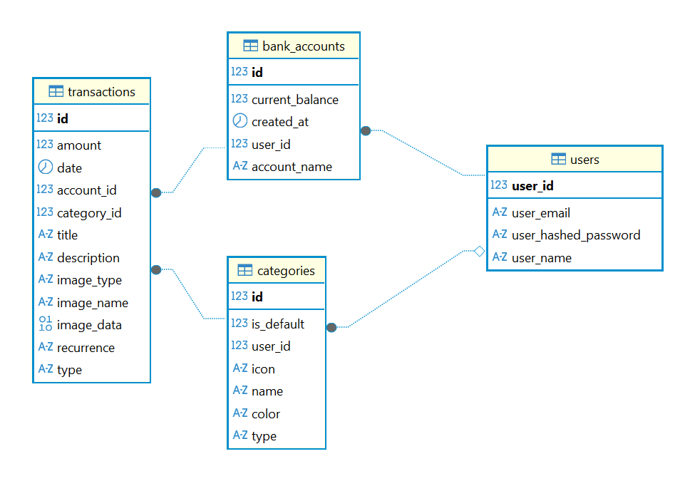
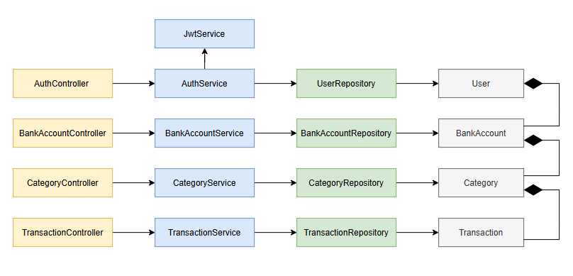
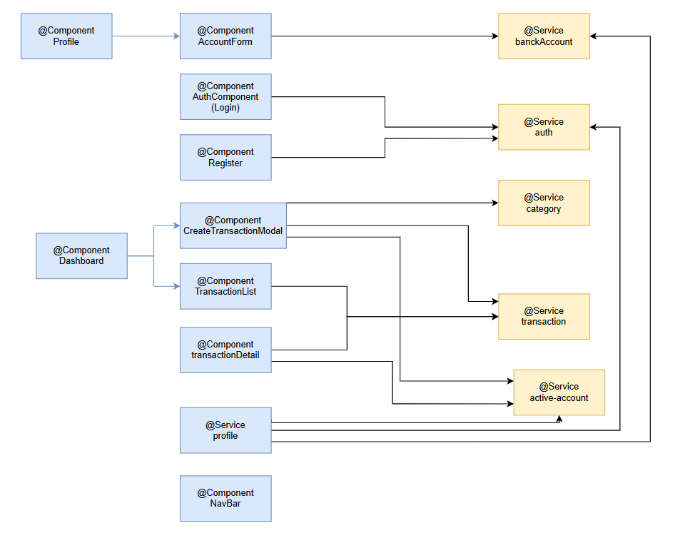

# Tabla de contenidos 
1. [Introducción](#📝-introducción)
2. [Tecnologías](#💻-tecnologías)
3. [Herramientas](#🛠️-herramientas)
4. [Arquitectura](#🏗️-arquitectura) 
5. [Control de calidad](#✅-control-de-calidad)
6. [Proceso de desarrollo](#⚙️-proceso-de-desarrollo)
7. [Ejecución y edición de código](#🚀-ejecución-y-edición-de-código)

## 📝 Introducción

Smart Spend es una aplicación web SPA (Single Page Application) desarrollada con **Angular**, que carga una única página HTML inicial y gestiona dinámicamente las vistas y el contenido a través del framework, ofreciendo así una experiencia fluida y rápida al usuario sin necesidad de recargar la página completa en cada navegación.

La aplicación se divide en tres componentes principales: 
- ***Cliente***: Angular + TypeScript, interfaz de usuario que permite desde el navegador visualizar la aplicación al cliente
- ***Servidor***: Spring Boot + REST APIs, encargado de la lógica de negocio, gestionando las peticiones del cliente y la persistencia de datos.
- ***Base de datos***: MySQL, almacena de forma persistente la información relacionada con las transacciones, usuarios y demas componentes de la app.

🧩 Resumen técnico

| Categoría                   | Descripción                                                                 |
| :-------------------------- | :-------------------------------------------------------------------------- |
| **Tipo**                    | Web SPA + API REST                                                          |
| **Tecnologías principales** | Angular, Spring Boot, MySQL                                                 |
| **Lenguajes**               | TypeScript, Java 17                                                         |
| **Servicios adicionales**   | GitHub Actions (CI/CD)                                                      |
| **Herramientas**            | Visual Studio Code, Postman, GitHub, Git, Docker                            |
| **Control de calidad**      | Tests unitarios, de integración y E2E con JUnit, RestAssured y Selenium     |
| **Despliegue**              | AWS (EC2) ejecutando Docker con la última versión estable publicada por CI/CD |
| **Proceso**                 | Iterativo e incremental con Kanban y ramas `feature/**` / `fix/**` / `main` |

## 💻 Tecnologías

### 🔧 Backend

**🚀 Spring Boot**  
Framework de Java para la creación de servicios RESTful con un servidor embebido y características listas para producción. 
**Spring Boot** simplifica la configuración, integra JPA y gestiona el backend de la API de SmartSpend.  
🔗 [Spring Boot](https://spring.io/projects/spring-boot)

---

**☕ Java 17**  
Lenguaje de programación orientado a objetos utilizado para el desarrollo de la lógica de negocio y los servicios del backend.  
SmartSpend utiliza **Java 17** por su estabilidad, soporte a largo plazo y compatibilidad con versiones modernas de Spring.  
🔗 [Java](https://www.oracle.com/java/)

---

**📦 Maven**  
Herramienta de automatización y gestión de dependencias para proyectos Java.  
Se emplea para compilar, ejecutar pruebas y empaquetar el backend, además de gestionar las librerías externas.  
🔗 [Maven](https://maven.apache.org)

---

**🗃️ MySQL / H2 Database**  
Sistemas de bases de datos relacionales utilizados para almacenar la información de las transacciones.  
- **MySQL:** utilizado en entornos de producción.  
- **H2:** base de datos en memoria utilizada en desarrollo y testing automatizado.  
🔗 [MySQL](https://www.mysql.com) | [H2](https://www.h2database.com)

---

**🧪 RestAssured**  
Librería Java para la realización de pruebas sobre APIs REST mediante una sintaxis fluida y expresiva.  
Se emplea en SmartSpend para validar los endpoints del backend en las pruebas de sistema.  
🔗 [RestAssured](https://rest-assured.io)

---

**🧩 Selenium**  
Framework de automatización que simula interacciones de usuario con la interfaz web.  
Se utiliza en las pruebas **E2E (end-to-end)** para verificar la integración completa entre el frontend y el backend.  
🔗 [Selenium](https://www.selenium.dev)

---

### ⚛️ Frontend

**⚛️ Angular 19**  
Framework moderno basado en TypeScript para la creación de aplicaciones de una sola página (SPA).  
La interfaz de SmartSpend se desarrolla en **Angular 19**, para ofrecer una experiencia fluida y responsive.  
🔗 [Angular](https://angular.dev)

---

**🛠️ TypeScript**  
Superset de JavaScript que añade tipado estático y características modernas del lenguaje.  
Permite mejorar la mantenibilidad del código, detectar errores de tipo en tiempo de desarrollo y aumentar la legibilidad.  
🔗 [TypeScript](https://www.typescriptlang.org)

---

**📦 Node.js & npm**  
***NodeJS*** Entorno de ejecución JavaScript y gestor de paquetes utilizados para construir y ejecutar el frontend de Angular.  
**NPM** gestiona las dependencias y scripts de construcción del proyecto.  
🔗 [NodeJs](https://nodejs.org) | [npm](https://www.npmjs.com)

---

### 🐳 DevOps y control de calidad

**🐳 Docker**  
Plataforma de containerización que permite empaquetar la aplicación y sus dependencias en contenedores ligeros y portables.  
SmartSpend utiliza **Docker** para crear imágenes del frontend y backend, facilitando el despliegue y garantizando consistencia entre entornos.  
🔗 [Docker](https://www.docker.com)

---

### 🧪 Newman  
Ejecutor de línea de comandos para colecciones de Postman que permite automatizar las pruebas de API.  
Se utiliza en SmartSpend para ejecutar pruebas automatizadas de los endpoints REST dentro del pipeline de CI/CD.  
🔗 [Newman](https://www.npmjs.com/package/newman)

---

### 🤖 GitHub Actions  
Sistema de Integración Continua (CI) que automatiza la compilación, pruebas y análisis del proyecto.  
Los flujos de trabajo ejecutan pruebas del backend y del frontend y aplican controles de calidad antes de integrar cambios en la rama principal (`main`).  
🔗 [Github Actions](https://github.com/features/actions)

---

## 🛠️ Herramientas
### 🖥️ Visual Studio Code  
IDE utilizado para el desarrollo con soporte en Java, TypeScript y Docker.  
[Visual Studio Code](https://code.visualstudio.com)

---

### 📬 Postman  
Cliente API utilizado para probar y documentar los endpoints REST del backend.  
Incluye una colección de ejemplos CRUD de la API de SmartSpend.  
🔗 [Postman](https://www.postman.com)

---

### 🔧 Git y GitHub  
Sistema de control de versiones y servicio de repositorios en la nube empleados para el desarrollo colaborativo.  
Estrategia de ramas utilizada:  
- `main`: rama estable de producción.  
- `feature/**`: desarrollo de nuevas funcionalidades.  
- `fix/**`: corrección de errores y mejoras.  
🔗 [Git](https://git-scm.com) | [Github](https://github.com)
## 🏗️ Arquitectura

## ✅ Control de calidad

El proyecto SmartSpend incorpora un sistema de control de calidad automatizado que garantiza la fiabilidad, mantenibilidad y correcto funcionamiento del software antes de su despliegue.  
Este control se centra en dos pilares principales: **pruebas automáticas** y**automatización del proceso de integración continua (CI/CD)**.

---

### Tipos de pruebas realizadas

Se han desarrollado diferentes tipos de pruebas tanto en el **servidor (backend)** como en el **cliente (frontend)**, con el objetivo de cubrir el mayor espectro posible de validaciones automáticas.

| Tipo de prueba | Descripción | Tecnología utilizada |
|----------------|-------------|----------------------|
| **Pruebas unitarias** | Validan el correcto funcionamiento de servicios individuales y lógica de negocio, de forma aislada. | JUnit 5 |
| **Pruebas de sistema (API)** | Verifican los endpoints del backend asegurando que las operaciones CRUD respondan correctamente. | RestAssured + Newman |
| **Pruebas de interfaz (UI / E2E)** | Simulan la interacción real del usuario con la interfaz web y validan la visualización de datos. | Selenium |
| **Pruebas automáticas integradas en CI** | Se ejecutan en cada *push* o *pull request* dentro de GitHub Actions para validar el estado del proyecto. | GitHub Actions + Maven + npm + Newman |

---

### Integración continua (CI)

La automatización del control de calidad se realiza mediante **GitHub Actions**, que ejecuta flujos de trabajo (workflows) configurados para diferentes momentos del desarrollo:

| Workflow | Activación | Acciones realizadas |
|-----------|-------------|----------------------|
| **Basic Quality Check** | En cada *push* a ramas `feature/**` o `fix/**`. | Compila el backend, construye el frontend, ejecuta los tests unitarios y de integración. |
| **Complete Quality Check** | En cada *pull request* hacia `main`. | Ejecuta tests unitarios del backend, construye imágenes Docker y ejecuta pruebas de API con Newman via Docker Compose. |
| **Docker CI/CD** | En cada *push* a `main`, releases y manualmente. | Construye y publica imágenes Docker del frontend y backend en DockerHub con versionado automático. |

Estos procesos se ejecutan automáticamente en entornos **Ubuntu** con **JDK 17** y **Node.js 20**, replicando las condiciones de producción.  
De este modo, se garantiza que el sistema sea estable, reproducible y libre de errores antes de integrar nuevas funcionalidades.

---

### Evidencias y métricas

---

### Conclusión del control de calidad

El proceso de control de calidad implementado en SmartSpend permite un desarrollo **robusto, automatizado y con trazabilidad completa**, cumpliendo con las buenas prácticas de **DevOps** y los principios de **integración continua**.  
Gracias a la combinación de pruebas automáticas y CI/CD, se asegura que el sistema mantenga un alto estándar de calidad en todas las fases del desarrollo.

## ⚙️ Proceso de desarrollo

El desarrollo de **SmartSpend** se ha llevado a cabo siguiendo un proceso iterativo e incremental, basado en los principios del Manifiesto Ágil y apoyado en prácticas de Extreme Programming (XP) y Kanban.  
El objetivo ha sido mantener un flujo de trabajo continuo, con entregas pequeñas y verificables, permitiendo integrar nuevas funcionalidades sin comprometer la estabilidad del sistema.

---

### Gestión de tareas y planificación

La gestión de las tareas se ha realizado con el tablero **GitHub Projects**, organizado bajo la metodología **Kanban**, con tres columnas principales:

| Estado | Descripción |
|---------|--------------|
| 📝 **To Do** | Tareas pendientes de implementar. |
| ⚙️ **In Progress** | Funcionalidades en desarrollo o revisión. |
| ✅ **Done** | Tareas completadas y verificadas mediante pruebas. |

[Link al tablero](https://github.com/orgs/codeurjc-students/projects/28/views/1)

---

### Uso de Git y estrategia de ramas

El proyecto se gestiona mediante **Git** como sistema de control de versiones y **GitHub** como plataforma de colaboración y seguimiento.  
Se ha seguido una **estrategia de ramas basada en funcionalidades** (*feature branching*):

| Rama | Propósito |
|-------|------------|
| `main` | Contiene la versión estable y funcional del proyecto. |
| `feature/**` | Desarrollos nuevos o ampliaciones de funcionalidades. |
| `fix/**` | Corrección de errores o ajustes menores. |

Cada nueva característica se desarrolla en su rama independiente y se valida mediante una **Pull Request**, revisando los resultados del pipeline antes de fusionarla en `main`.

📈 **Métricas del repositorio (fase 2):**
- Commits totales: 
- Ramas activas: 
- Issues gestionadas: 
- Pull requests completadas: 

---

### Integración continua y automatización (CI/CD)

Se ha implementado un sistema de **Integración Continua (CI)** con **GitHub Actions**, que automatiza las siguientes etapas:

| Fase | Acción automatizada | Tecnología |
|------|----------------------|-------------|
| 🧱 **Build Backend** | Compilación del proyecto Spring Boot y verificación del perfil `dev`. | Maven |
| 🧩 **Build Frontend** | Instalación de dependencias y construcción del proyecto Angular. | npm / Node.js |
| 🧪 **Testing** | Ejecución de pruebas unitarias, RestAssured y Selenium (headless). | JUnit / Selenium |
| 🚀 **Validación final** | Fusión a `main` solo si todos los checks son correctos. | GitHub Actions |

Workflows configurados:
- `CI - Basic Quality Check`: ejecuta pruebas básicas en ramas `feature/**` y `fix/**`.  
- `CI - Complete Quality Check`: ejecuta tests unitarios y pruebas de API con Newman antes de integrar a `main`.
- `Docker CI/CD`: construye y publica imágenes Docker en DockerHub al fusionar en `main` o crear releases.

> ✅ Este enfoque permite detectar errores en etapas tempranas, mantener un estándar de calidad constante y asegurar que el código fusionado sea siempre estable.

### Despliegue en producción (AWS)

#### Estado actual

La aplicación está desplegada en **AWS** mediante una instancia **EC2** que ejecuta continuamente la imagen **Docker** correspondiente a la **última versión estable** publicada en DockerHub por el workflow `Docker CI/CD`.

**Configuración actual:**
- **Infraestructura:** Instancia EC2 en AWS con Docker instalado
- **Actualización de versiones:** Manual — apuntando a la última etiqueta estable en DockerHub
- **Base de datos:** MySQL persistente en la EC2
- **Acceso:** IP pública de la EC2 para acceder a la aplicación

#### Mejoras futuras: Automatización de releases

Actualmente, el despliegue se realiza de forma manual, pero lo ideal sería automatizar la actualización de la EC2 cada vez que se genera una nueva **release** en GitHub. Para ello, se recomienda implementar un workflow adicional que:

1. **Detecte releases en GitHub** — Se active automáticamente cuando se crea una nueva release en el repositorio.
2. **Descargue la imagen Docker actualizada** — Ejecute un comando en la EC2 para descargar la nueva versión desde DockerHub.
3. **Reinicie los contenedores** — Detenga la versión anterior e inicie los nuevos contenedores con la última imagen.
4. **Valide la salud de la aplicación** — Compruebe que la aplicación está levantada y responde correctamente.

**Próximos pasos:**
- Configurar **Secrets en GitHub** para almacenar credenciales SSH de acceso a la EC2.
- Crear workflow `Deploy to EC2 on Release` que ejecute scripts de validación y actualización.
- Implementar **health checks** en la EC2 para verificar que la aplicación sigue activa tras cada despliegue.

## 🧱 Arquitectura

### Modelo de dominio 

---
### Arquitectura del servidor

--- 

### Arquitectura del cliente 
